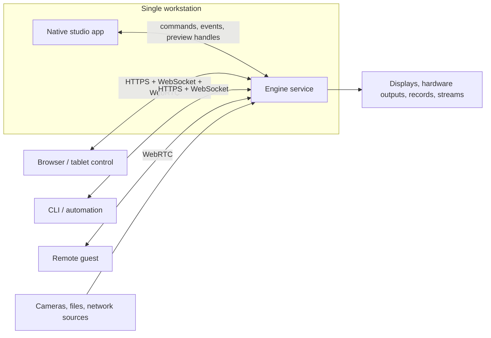

# FreeMix product and architecture specification

Status: draft baseline  
Last updated: 2026-07-23  
Target: vMix-class live production, not binary or UI compatibility with vMix  
Primary implementation language: Rust

## 1. Product statement

FreeMix is a portable, GPU-first live production system. It combines a real-time
media engine, a native studio application, a headless server, browser and mobile
control surfaces, and extension APIs. A production can run entirely on one
workstation or be controlled remotely without changing its state model.

All first-party application, service, domain, UI, and adapter code is written in
Rust. External codec, browser, driver, and vendor SDK libraries may be used
through narrow FFI/process boundaries where reimplementing them would be unsafe,
legally impossible, or counterproductive.

“All vMix features” means functional coverage of the vMix 29 public feature
surface documented in [feature-parity.md](feature-parity.md). It does not mean
copying vMix source code, branding, proprietary templates, undocumented
behavior, or licensed SDKs without permission.

## 2. Product contract

FreeMix shall:

1. Switch, composite, mix, monitor, stream, and record live audio/video with a
   predictable latency budget.
2. keep decoded video on the GPU whenever the active platform APIs permit it;
3. run the production engine on Windows, macOS, and Linux;
4. offer a native operator app, a headless server, a browser control client, and
   a versioned control API;
5. support local, remote, and distributed contribution workflows;
6. degrade by capability, never by undefined behavior, when a platform lacks a
   vendor SDK or hardware feature;
7. recover production state and playable recordings after a process or power
   failure;
8. make every operator action command-addressable, undoable where safe, and
   observable;
9. preserve audio continuity and output timing when a UI or control client
   disconnects; and
10. remain usable without a cloud service, while allowing optional cloud
    rendezvous and collaboration services.

## 3. Architecture decisions at a glance

| Concern | Baseline decision |
|---|---|
| GPU API | `wgpu`, using D3D12 on Windows, Metal on Apple platforms, and Vulkan on Linux |
| Native studio UI | `egui`/`eframe` immediate-mode UI over a replicated read model |
| Browser control UI | Rust/Wasm DOM UI; WebRTC for live previews |
| Media interoperability | FFmpeg-backed codec/demux/mux adapter behind narrow Rust traits |
| Real-time scheduling | Dedicated media threads; no async executor on render/audio hot paths |
| Service runtime | Tokio for control, storage, discovery, HTTP, WebSocket, and background I/O |
| Control protocol | Versioned commands plus ordered events over WebSocket; HTTP for resources |
| Remote media | WebRTC for guests/previews, SRT/RIST-class adapters for contribution, RTMP/SRT/HLS for delivery |
| State | Single-writer engine authority, immutable client snapshots, monotonic revisions |
| Projects | Versioned manifest plus content-addressed media references and autosave journal |
| Plugins | Validated shader packages; sandboxed Wasm automation/data; class-specific native device/codec and real-time DSP hosts |

Dependencies are architectural candidates, not permanently pinned choices.
Phase 0 prototypes must validate GPU texture interop, codec licensing, and
capture/output SDK behavior before the public API is frozen.

## 4. Deployment shapes

The desktop app launches an engine child process by default. It communicates
through the same authenticated protocol as a remote client, with an optimized
local preview transport. A headless deployment launches only the engine and
server. Crashing or restarting the UI must not stop an on-air production.

## 5. Specification map

1. [Product scope](product-scope.md) — users, use cases, requirements, scope,
   terminology, and parity rules.
2. [Feature parity](feature-parity.md) — the vMix-class feature inventory and
   acceptance criteria.
3. [System architecture](architecture.md) — processes, state, clocks, graph,
   scheduling, and failure boundaries.
4. [Rust workspace and crates](crates.md) — crate ownership, dependency rules,
   feature flags, and compilation strategy.
5. [Media pipeline](media-pipeline.md) — ingest, synchronization, audio/video
   graphs, backpressure, replay, recording, and output.
6. [GPU and rendering](gpu-and-rendering.md) — surfaces, color, compositing,
   effects, zero-copy paths, and capability tiers.
7. [Server/client protocol](server-client-protocol.md) — API semantics,
   discovery, authentication, commands, events, previews, and compatibility.
8. [UI and operator workflows](ui-ux.md) — immediate-mode UI boundaries and
   step-by-step production workflows.
9. [Platform portability](platform-portability.md) — OS and hardware adapters,
   packaging, and capability reporting.
10. [Security and reliability](security-reliability.md) — threat boundaries,
    secrets, recovery, isolation, and on-air safety.
11. [Testing and performance](testing-and-performance.md) — quality gates,
    fixtures, benchmarks, latency budgets, and soak tests.
12. [Implementation roadmap](implementation-roadmap.md) — vertical slices,
    phase exit criteria, dependencies, and team guidance.
13. [Sources and constraints](sources.md) — feature baseline and relevant
    technical references.

## 6. Definition of done

FreeMix reaches “vMix-class parity” only when:

- every parity item marked `P0`, `P1`, or `P2` has an automated or scripted
  acceptance test on every applicable platform;
- every named vendor/protocol integration has its authorized adapter; an
  equivalent standards-based workflow is a useful fallback but does not close
  that named parity row;
- a reference production can run for 24 hours without A/V drift, unbounded
  memory growth, a corrupted recording, or operator-control loss;
- engine upgrades preserve the preceding two project schema versions and one
  protocol major version;
- the baseline 1080p60 and 2160p60 performance profiles in
  [testing-and-performance.md](testing-and-performance.md) pass; and
- the compatibility ledger contains no unclassified vMix 29 public feature.

## 7. Deliberate non-goals

- Pixel-identical reproduction of the vMix interface.
- Loading vMix proprietary project files, titles, or scripts in the first
  release. A later importer may translate documented formats where legally
  permitted.
- Pretending every hardware SDK is available on every OS.
- Running third-party native media plugins in the core render process by
  default.
- Using distributed rendering for a single program output in the first release;
  remote sources and remote control come first.
