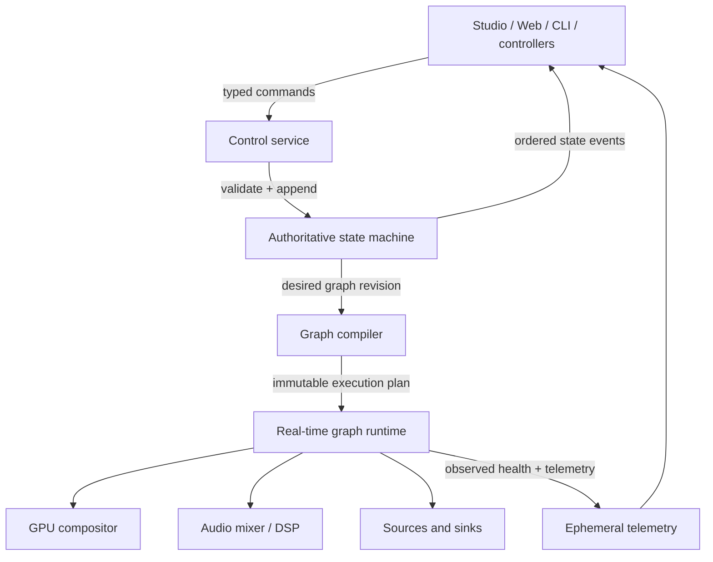

# System architecture

[Specification index](README.md)

## 1. Process model

FreeMix uses one authoritative engine process per production.

| Process | Owns | Must not own |
|---|---|---|
| `freemixd` | Devices, clocks, graph, GPU, audio, recorders, streams, replay, durable production state | Operator window state |
| `freemix-studio` | Native windows, panel layout, selection, drafts, local key handling, preview presentation | Source devices or authoritative state |
| `freemix-web` | Browser layout, role-scoped commands, remote previews | Production media graph |
| `freemix-plugin-host` | Wasm and native device/codec plugin lifecycle and IPC | Global project state |
| `freemix-dsp-host` | Deadline-bound real-time audio plugin chain over shared rings | Device/project authority |
| `freemix-capture-node` | User-session camera, screen/window, and application-audio access unavailable to an OS service | Authoritative project state or final composition |
| `freemix-cli` | Administrative and automation commands | Long-lived state |

The studio launches and supervises `freemixd` in all-in-one mode. A production
engine may instead run as an OS service. Only one engine instance can claim a
device unless an adapter explicitly supports sharing.

The capture node is a trusted per-user-session broker. It pairs with the engine,
publishes capabilities, transfers timed media through authenticated local
IPC/shared surfaces, and reports the additional clock and latency boundary.
This is required for macOS privacy controls, Windows session isolation, and
Linux desktop portals when a system service cannot capture the logged-in
session directly.

## 2. Control plane and media plane



The control plane may allocate, perform storage I/O, and use Tokio. The media
plane uses preallocated pools, bounded queues, dedicated threads, and immutable
plans. The two planes communicate through lock-free or short-held,
non-real-time-owned structures. The UI never calls a device SDK directly.

## 3. State model

State is separated into:

- **Project state:** durable input definitions, scenes, routes, buses,
  shortcuts, titles, outputs, and settings.
- **Desired runtime state:** playing, recording, streaming, program/preview,
  overlay state, requested device format.
- **Observed runtime state:** device connection, negotiated format, timestamp
  quality, queue depth, drops, errors, encoder and disk health.
- **Client state:** panel arrangement, selection, filters, focus, drafts, and
  local preview subscriptions.

The engine is a single writer. Each accepted command advances a `u64` revision
and emits ordered state events. High-rate meters, thumbnails, clocks, and
statistics are lossy ephemeral streams and do not advance the durable revision.
Coalescible intents such as an in-progress fader or PTZ drag update observed
live parameters but advance the durable revision only when committed.

Commands that alter several related values are one transaction. Switching
Program, applying audio-follow-video, and firing transition triggers must be
committed as one logical action even though the graph realizes them at a later
frame boundary.

### 3.1 Accepted and realized state

Configuration is tracked by `state_epoch`, durable `revision`, and runtime
`generation`. A command may progress through:

```text
accepted -> preparing -> scheduled -> realized
                    \-> failed
           \-> superseded
```

- `accepted` means validation and the required durable write succeeded.
- `preparing` warms devices, codecs, shaders, and resources.
- `scheduled` names affected clock domains and their target boundaries.
- `realized` reports the generation active in each required domain.
- `failed` reports whether desired state was rolled back, retained for retry,
  or realized through a declared fallback.
- `superseded` means a later accepted command made realization unnecessary.

Clients display desired and observed state separately until all required
domains realize the generation. A plan spanning independent video outputs and
audio clocks uses bounded two-phase activation: prepare everything, schedule
each domain at its next compatible boundary, then publish aggregate
realization. There is no assumed universal A/V boundary.

## 4. Project storage

A project is a directory or portable bundle:

```text
show.freemix/
  project.json             # versioned declarative manifest
  journal/                 # checksummed replayable mutation batches
  receipts/                # idempotency and irreversible-action outcomes
  assets/                  # optional bundled, content-addressed media
  thumbnails/              # disposable cache
  plugin-state/            # namespaced, versioned plugin data
  recovery/                # recorder and replay recovery metadata
```

External media references store a stable asset ID, original URI, relative path
when possible, content hash, size, and optional proxy. Loading validates before
mutating the active session. Save uses a new manifest plus atomic rename.
Compaction replaces the journal only after the new manifest is durable.

Only replayable declarative mutations enter the recovery journal. Edge-triggered
live actions—Cut, fire stinger, snapshot, replay take, start/stop record, and
start/stop stream—write action receipts and idempotency results, not commands to
re-execute. Persistent desired states such as “service policy wants Output A
running” are separate fields with explicit restart policy. Recovery restores
configuration, reconciles safe desired states, and never repeats an irreversible
action merely because its acknowledgement was lost.

During current development, loading accepts the exact current schema only.
Breaking schema changes replace the contract and its current-state coverage in
place; old-version loading is outside this development contract.

## 5. Graph model

The editable graph contains typed nodes and ports:

- sources: video, audio, timed metadata, control data;
- transforms: decode, rate/size/color conversion, delay, effects, keying;
- composition: layer, overlay, mix, transition, multiview;
- audio: channel map, delay, DSP, fader, bus, meter;
- sinks: display, hardware, encoder, muxer, network, preview, recorder; and
- side channels: tally, timecode, captions, health.

Graph compilation:

1. Validate IDs, ports, cycles, and requested capabilities.
2. Propagate format and clock constraints backward from outputs.
3. Select source modes and shared conversion nodes.
4. Select CPU, portable GPU, or native external memory domains.
5. Deduplicate common decode, scale, color, and composite work.
6. Allocate bounded pools and queues from a declared budget.
7. Produce an immutable execution plan and a human-readable decision report.
8. Warm codecs and GPU pipelines.
9. Schedule the new generation at compatible boundaries for every affected
   clock/output domain.
10. Retire the old plan after its frames and GPU fences complete.

Cycles are rejected except explicit delay/feedback nodes. Outputs cannot
silently refer to themselves.

## 6. Clocking and synchronization

Every media item carries:

- source timestamp and original timebase;
- normalized presentation timestamp and duration;
- clock-domain ID;
- sequence number;
- discontinuity and corruption flags;
- optional timecode and capture timestamp.

Supported clock masters are monotonic free-run, audio device, capture device,
PTP, and external reference/genlock adapters. The scheduler maps all source
domains into the selected output timeline.

Audio remains continuous. Small drift is corrected through adaptive resampling;
large discontinuities reset the affected synchronizer with a measured event.
Video policy is configurable per input: nearest frame, drop late, duplicate
last, or frame blend/interpolate through an optional effect. Synchronization
error and correction rate are visible.

## 7. Threading model

- One render submission thread owns the production GPU queue.
- Each low-latency audio device has a real-time callback connected to a
  precomputed audio plan.
- Capture callbacks perform minimal ownership transfer into bounded queues.
- Decode and encode use workload-class worker pools, not the general async pool.
- Mux, recorder, replay index, and disk flush have bounded dedicated workers.
- Tokio runs API, discovery, persistence coordination, telemetry fan-out, and
  non-real-time network control.

No hot-path component may create an unbounded task, channel, frame queue, or
cache. Each overflow policy is declared in the graph plan and counted.

## 8. Failure boundaries

| Failure | Required behavior |
|---|---|
| UI/client crash | Engine and all active outputs continue |
| Input loss | Hold/fallback slate according to policy; preserve routing; retry with backoff |
| Encoder failure | Other outputs continue; affected sink restarts or fails visibly |
| Disk slow/full | Warn before exhaustion; split/finalize safely; stop only affected recorders |
| GPU device loss | Freeze/fallback outputs, recreate device and graph once, preserve audio if possible |
| Native plugin crash | Host restarts; graph substitutes bypass/fallback; engine survives |
| Network control loss | No implicit state change; client resumes events from revision |
| Corrupt project | Refuse transactional load; keep current production unchanged |

## 9. Capability model

A capability record includes a stable key, provider, version, limits, supported
formats, memory domains, latency modes, exclusivity, and health. Project
requirements are matched before activation.

Example keys:

```text
gpu.compositor.wgpu
gpu.interop.dmabuf
codec.h264.decode.nvdec
codec.h265.encode.videotoolbox
capture.decklink.sdi
output.decklink.key_fill
network.ndi.v6.receive
audio.plugin.vst3
clock.ptp
```

The UI is generated from capabilities rather than OS-name conditionals. A
missing adapter is a normal, explainable state.
