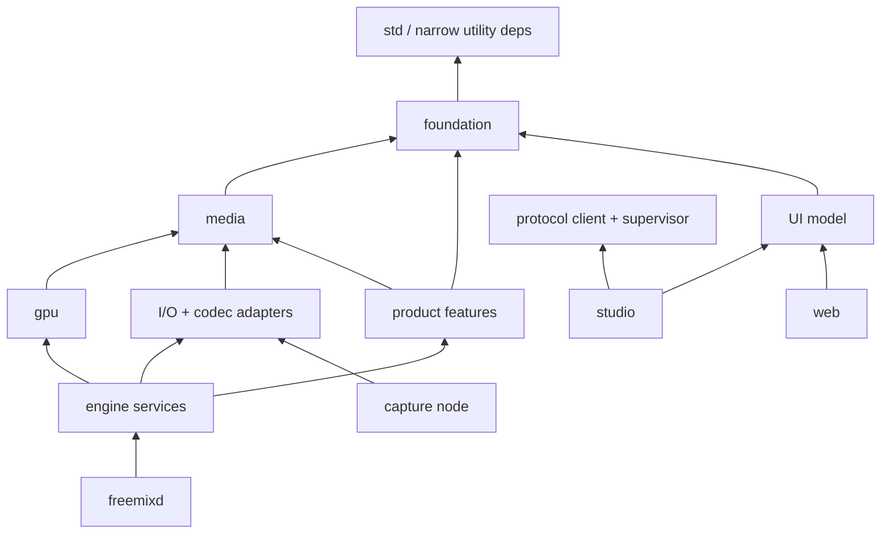

# Rust workspace and crate boundaries

[Specification index](README.md)

## 1. Workspace shape

The workspace favors stable leaf crates and optional adapter crates. It avoids
both a monolith and a crate per struct.

```text
Cargo.toml
apps/
  freemixd/
  freemix-studio/
  freemix-web/
  freemix-cli/
  freemix-plugin-host/
  freemix-dsp-host/
  freemix-capture-node/
crates/
  foundation/
  media/
  gpu/
  io/
  features/
  services/
  ui/
tools/
  xtask/
```

## 2. Foundation crates

| Crate | Responsibility | Forbidden dependencies |
|---|---|---|
| `fm-types` | IDs, rational frame rates, timecode, timestamps, formats, color/audio metadata, small errors | Tokio, wgpu, GUI, FFmpeg, OS APIs |
| `fm-model` | Versioned project/domain configuration and validation | Device SDKs, UI, async runtime |
| `fm-command` | Domain commands, results, events, transactions, inverse intents | Transport and engine runtime |
| `fm-protocol` | Wire DTOs, version negotiation, serialization fixtures | Domain implementation details |
| `fm-capabilities` | Capability descriptors, matching, limits, compatibility reports | Backend implementations |
| `fm-plugin-api` | Versioned WIT and C ABI declarations, opaque handles, ownership rules | Plugin host implementation |

These crates compile quickly and are used by nearly every binary. Keep their
public types small, owned, and independent of a serialization framework where
practical. Wire DTOs convert explicitly to domain types.

## 3. Media crates

| Crate | Responsibility |
|---|---|
| `fm-frame` | Decoded frames, encoded packets, timed data, erased resource leases, memory domains, fences, pools |
| `fm-clock` | Clock domains, mapping, timecode, PTP/genlock interfaces, drift estimation |
| `fm-graph` | Editable graph, validation, capability negotiation, immutable execution plan |
| `fm-scheduler` | Frame deadlines, pacing, queue policy, plan swap, synchronization telemetry |
| `fm-audio` | Sample-accurate audio plan, buses, mapping, built-in DSP, meters |
| `fm-video` | CPU/reference video transforms, rate conversion, deinterlace policies |
| `fm-playback` | File/list/image-sequence transport, seeking, marks, speed, playlists |
| `fm-record` | Recorder coordination, segmenting, repair metadata, ISO/MultiCorder |
| `fm-replay` | Rolling stores, event database, two playback channels, highlights |

`fm-frame` contains safe portable handles plus private backend tokens. It must
not expose `AVFrame`, `GstBuffer`, `ID3D12Resource`, `CVPixelBuffer`, or DMA-BUF
types in its public API.

Its public `ResourceLease` is type-erased and carries only a bridge/resource ID,
memory-domain metadata, synchronization tokens, and release ownership. At the
application composition root, a target-specific external-memory bridge pairs a
producer with `fm-gpu-dx12`, `fm-gpu-metal`, or `fm-gpu-vulkan`. Concrete native
handles remain inside that bridge. This prevents a wgpu dependency/cycle while
still giving frames explicit lifetime and fence semantics.

## 4. GPU crates

| Crate | Responsibility |
|---|---|
| `fm-gpu` | Portable wgpu device/queue facade, pools, fences, capability profile, device recovery |
| `fm-color` | Color transforms, transfer functions, tone mapping, LUT representation, test vectors |
| `fm-compositor` | Layers, overlays, keys, masks, transforms, transitions, DVE, multiview |
| `fm-scopes` | Waveforms, parade, vectorscope, histograms, pixel probe |
| `fm-gpu-dx12` | D3D12 shared resources and Media Foundation/NVENC/QSV/AMF interop |
| `fm-gpu-metal` | IOSurface/Metal/CoreVideo/VideoToolbox interop |
| `fm-gpu-vulkan` | DMA-BUF/Vulkan/VA-API/NVENC interop |

Native GPU crates contain the smallest possible audited `unsafe` boundary.
They are target-specific leaves; portable crates never depend on them.

## 5. I/O and codec crates

| Crate | Responsibility |
|---|---|
| `fm-io-api` | Source/sink factories, discovery, formats, clocks, health, hot-plug contracts |
| `fm-codec-api` | Decoder, encoder, demuxer, muxer contracts and capability queries |
| `fm-codec-ffmpeg` | FFmpeg implementation, software codecs, hardware device adapters |
| `fm-io-network` | RTP/RTSP/RTMP, MPEG-TS, HLS/DASH, common network buffering |
| `fm-browser-input` | Isolated browser process, interactive surface/audio, custom CSS, navigation policy |
| `fm-io-srt` | SRT caller/listener/rendezvous and statistics |
| `fm-io-webrtc` | Guests, remote preview, return media, ICE/TURN, data channels |
| `fm-io-ndi` | Licensed NDI discovery/send/receive/metadata/tally |
| `fm-io-omt` | OMT send/receive and direct-record capability |
| `fm-io-windows` | Media Foundation, WASAPI, screen/window capture, virtual devices |
| `fm-io-macos` | AVFoundation, CoreAudio, ScreenCaptureKit, virtual devices |
| `fm-io-linux` | PipeWire, V4L2, ALSA/JACK, Wayland/X11 capture, virtual devices |
| `fm-io-decklink` | Blackmagic capture/output and key/fill |
| `fm-io-aja` | AJA capture/output and key/fill |
| `fm-io-bluefish` | Bluefish444 capture/output |

Vendor crates are optional and must build only when their SDK is discovered
explicitly. Missing SDKs do not prevent the portable workspace from building.
A single adapter may use GStreamer internally if it is the best supported
platform route, but GStreamer types remain private to that adapter.

## 6. Product feature crates

| Crate | Responsibility |
|---|---|
| `fm-switcher` | Preview/program, Mix inputs, transition state, FTB, overlays, triggers |
| `fm-titles` | Title scene model, layout, animation, tickers, clocks, text shaping |
| `fm-data` | Data source adapters, mapping, polling, transforms, cache |
| `fm-social` | Moderated social/chat aggregation and title mapping adapters |
| `fm-automation` | Shortcuts, activators, triggers, macros, schedules, tally derivation |
| `fm-ptz` | PTZ protocol adapters, presets, digital PTZ, joystick intents |
| `fm-telestrator` | Stroke model, collaboration, render layer, undo |
| `fm-guest` | Guest lobby/session state, mix-minus plans, chat, permissions |
| `fm-presentations` | Slide/document import and presentation navigation |
| `fm-virtual-set` | Virtual-set scene model, talent/key bindings, camera/zoom presets |
| `fm-plugin-host-api` | Engine-side plugin lifecycle protocol |

These crates express behavior through `fm-command` and graph descriptions. They
do not own devices.

## 7. Service crates

| Crate | Responsibility |
|---|---|
| `fm-engine` | Composition root for authoritative state and media runtime |
| `fm-control` | Command validation, authorization hook, revision log, subscriptions |
| `fm-server` | HTTP/WebSocket/WebRTC signaling, discovery, rate limits |
| `fm-vmix-compat` | Complete documented vMix 29 HTTP/XML/TCP/tally compatibility surface |
| `fm-persistence` | Projects, journal, migrations, asset relink/bundle, secrets references |
| `fm-auth` | Pairing, users, roles, token/certificate lifecycle |
| `fm-plugin-host` | Native/Wasm discovery, isolation, IPC, crash handling |
| `fm-dsp-host` | Shared-memory real-time DSP hosting, one-block latency contract, deadline and bypass ramp |
| `fm-observability` | Tracing, metrics, health, support bundles, redaction |

`fm-engine` is not a facade that re-exports the workspace. It wires concrete
adapters into narrow registries and owns process lifecycle.

## 8. UI crates and applications

| Package | Responsibility |
|---|---|
| `fm-ui-model` | Replicated snapshot, ordered event reduction, drafts, optimistic state, command intents |
| `fm-ui-widgets` | Theme-independent switcher/mixer/replay/scope view models |
| `fm-ui-egui` | Native immediate-mode panels, docking, input handling, GPU preview widgets |
| `freemix-studio` | Windowing, native menu/dialog integration, engine supervision/connect flow |
| `freemix-web` | Rust/Wasm semantic DOM control surface and PWA |
| `freemixd` | Headless composition and service lifecycle |
| `freemix-cli` | Discovery, project validation, commands, diagnostics, support bundles |
| `freemix-plugin-host` | Restricted child process for native plugin loading |
| `freemix-dsp-host` | Dedicated real-time shared-memory audio plugin process |
| `freemix-capture-node` | Per-user-session permission broker and camera/screen/application-audio publisher |

Native previews share GPU resources with the local engine where supported.
Remote/web previews are decoded WebRTC renditions. UI crates never link capture
card SDKs or FFmpeg.

## 9. Dependency direction



There is no generic “all apps depend on services” rule. `freemixd` selects and
links engine services and heavy backends. Studio links UI, protocol client,
window/preview presentation, and daemon supervision only. Web and CLI link only
their client needs. The capture node links session capture adapters but not the
engine/compositor. This binary-specific DAG is essential to crash isolation and
incremental builds.

Rules enforced by review and a dependency-lint script:

1. Foundation never depends upward.
2. Platform crates are leaves selected by an application.
3. `fm-model` contains no engine handles.
4. `fm-protocol` contains no wgpu, FFmpeg, OS, or UI types.
5. Async traits do not cross into real-time execution.
6. A crate cannot enable another crate’s vendor features transitively without
   the top-level binary choosing them.

## 10. Features and binaries

Example binary feature sets:

```text
freemixd --features ffmpeg,srt,webrtc,vulkan,pipewire
freemix-studio --features local-preview-dx12
freemix-plugin-host --features native-device-plugins,wasm-plugins
freemix-dsp-host --features vst3
freemix-capture-node --features media-foundation,wasapi,screen-capture
freemix-web --target wasm32-unknown-unknown
```

Use additive features. Avoid `full`, mutually exclusive hidden defaults, and
features that alter public type layout. `cfg(target_os)` belongs in adapter
selection, not domain behavior.

## 11. Compilation-performance policy

- Workspace resolver 2 or current stable equivalent.
- Small `default-members`: foundation, simulated engine, and common tests.
- Heavy C bindings, GUI, Wasm runtime, web target, and vendor SDKs are opt-in.
- One workspace version per dependency to avoid duplicate builds.
- Trait objects at backend boundaries prevent graph-wide monomorphization.
- Generated protocol/WIT bindings live in dedicated crates and update through
  `xtask`, not scattered build scripts.
- Shaders are validated and reflected once by `xtask`.
- CI uses `cargo hakari`-style feature unification if useful, a feature powerset
  job, and target-specific build jobs.
- Developer profiles use split debug info and incremental compilation;
  production uses thin LTO first, full LTO only when benchmarks justify it.
- Support `sccache` and lld/mold where stable for the target.
- Changing a UI panel must not rebuild codecs, vendor SDKs, or the engine.

## 12. Public API rules

- Public structs use private fields unless they are stable data records.
- Domain errors are typed and actionable; hot paths use compact error codes plus
  out-of-band details.
- `unsafe` requires a safety comment, a narrow module, and targeted tests.
- No global mutable singleton; process-level resources are owned by the
  composition root.
- Avoid `Arc<Mutex<_>>` as an architecture. Ownership and queues are explicit.
- Do not abstract a backend until two implementations or a stable external
  boundary demonstrate the seam.
