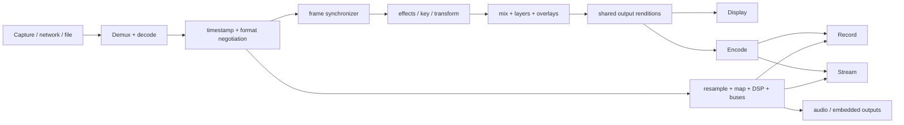

# Media pipeline

[Specification index](README.md)

## 1. End-to-end flow



The graph renders common work once. A 1080p program used by a display, recorder,
and stream is one composite with downstream forks unless color, overlay, frame
rate, or resolution requirements differ.

## 2. Frame contracts

`VideoFrame` describes format, dimensions, visible region, field order, sample
aspect ratio, color primaries, transfer, matrix, range, alpha mode, timing,
memory domain, and readiness/release synchronization.

Storage variants:

- pooled CPU planes;
- portable GPU texture;
- native external image handle wrapped by an adapter token.

`AudioBlock` contains planar `f32`, sample rate, channel layout, timing, clock
domain, sequence, and discontinuity. Internal audio defaults to 48 kHz planar
float; boundaries convert only when required.

`EncodedPacket` represents a compressed access unit without forcing decode. It
contains codec/config generation, PTS, DTS, duration, timebase, random-access
and dependency flags, discontinuity, side data, stream/channel identity, and an
owned payload lease. Codec configuration changes are explicit events. Muxers
cannot assume PTS equals DTS.

`TimedData` carries timecode, captions/subtitles, SCTE-class markers, ANC/VANC,
camera metadata, and protocol-specific side data with a declared schema and
clock domain. Unknown data can pass through only when the selected sink declares
safe support.

Frames are immutable after publication. Pools own recycling. Every queue
documents whether producers transfer, share, or retain ownership.

`fm-frame` does not contain wgpu or OS handle types. A GPU/native frame owns an
erased `ResourceLease` with memory-domain metadata, opaque bridge/resource IDs,
ready/release synchronization tokens, and a crash-safe release owner. At process
composition, a platform bridge registers the producer and selected GPU consumer.
The GPU backend allocates or imports bridge-compatible surfaces and returns an
`ImageLease`; concrete D3D12/IOSurface/DMA-BUF objects never cross the portable
API. Unsupported producer/consumer pairs negotiate one explicit copy.

For a local studio preview, the IPC lease protocol additionally carries engine
instance/generation, GPU adapter identity, duplicated OS-handle reference, ready
fence value, frame sequence, resize generation, and release acknowledgement.
The engine reclaims every lease on client death or timeout. Adapter mismatch,
daemon restart, or handle-transfer failure falls back to an encoded loopback
preview.

## 3. Source lifecycle

1. Enumerate factories and capabilities.
2. Resolve the project selector to a concrete device/stream/file.
3. Negotiate mode, clock, and memory domain.
4. Allocate bounded pools and warm decode.
5. Start into preroll; do not expose half-initialized media.
6. Mark ready after minimum video/audio buffers and timestamp validation.
7. Publish health and measured latency.
8. On loss, emit discontinuity, activate fallback, and retry according to policy.
9. On recovery, preroll and switch at a safe boundary.

Changing a source preserves input UUID and downstream settings. The old source
continues until the replacement is ready, then retires after outstanding frames.

## 4. Video synchronization

For each output tick, the synchronizer selects a frame from each active input
using mapped presentation time. Policies:

- `live_nearest`: choose nearest valid frame within tolerance;
- `drop_late`: drop frames that cannot make the deadline;
- `hold_last`: reuse last valid frame during short gaps;
- `strict`: fail the route rather than conceal timing;
- optional blend/interpolation node for deliberate conversion.

Interlaced sources preserve field metadata until an output or effect requires
deinterlacing. Supported policies include weave, bob, blend, and motion-adaptive
backend when available. Tests cover field order and cadence.

## 5. Audio pipeline

Per source:

```text
capture/decode -> clock correction -> sample-rate conversion -> channel map
-> input delay -> polarity/trim -> plugin/native DSP -> fader/pan
-> bus send matrix
```

Per bus:

```text
sum -> bus DSP/plugins -> limiter/meter -> destinations
```

The audio execution plan is flat and preallocated. Parameter changes use atomic
or lock-free ramps. Gain changes interpolate over a configured sample window.
Plugin latency contributes to delay compensation. A plugin that cannot complete
within its budget is bypassed and reported.

Meters use peak, true peak where enabled, RMS, and EBU/ITU-style loudness
windows. Meter transport is decimated and lossy; audio processing is not.

## 6. Backpressure

Every edge has a maximum depth, memory budget, and overflow action.

| Path | Default policy |
|---|---|
| Live capture to sync | Drop oldest video; never build latency silently |
| Audio capture | Consume continuously; drift-resample; report underrun/overrun |
| File playback decode | Pause producer at high watermark |
| GPU submission | Reject plan if worst-case in-flight budget is impossible |
| Live stream encoder | Drop/pace video within policy; preserve audio; reconnect sink |
| Recorder | Bounded staging; warn on sustained disk latency; split/stop affected sink safely |
| Remote preview | Reduce cadence/quality, then drop |
| Telemetry | Coalesce latest |

Queue depth is not a user-facing “latency” control unless its relationship to
timing is explicit.

## 7. Recording

Recorders receive a selected logical video output and explicit audio channel
map. Each recorder:

1. validates encoder, muxer, disk, and estimated capacity;
2. writes a sidecar recovery journal before accepting media;
3. starts at a clean video/audio boundary;
4. rotates segments on duration, size, timecode, or command;
5. periodically commits recoverable container state;
6. finalizes asynchronously on stop while status remains visible; and
7. verifies the resulting duration/tracks and records a checksum when requested.

ISO recording taps normalized sources before composition, ideally before
unnecessary decode/re-encode when the transport and container are compatible.
Its manifest records shared clock mapping and source discontinuities for post.

Packet passthrough is a separate planned branch:

```text
network/demux -> validate codec config/timestamps -> optional bitstream filter
-> segment/index -> replay or ISO mux
```

The graph compiler selects it only when codec, framing, color/audio metadata,
timebase, random-access cadence, and destination container are compatible.
Otherwise it inserts decode/normalize/encode explicitly. Passthrough and decoded
branches may coexist from one demuxer.

## 8. Instant replay

Replay uses append-only media segments plus an event database; events reference
time ranges and camera IDs rather than copying media.

- Up to eight synchronized camera records.
- Separate storage roots may be assigned per camera.
- Two playback channels, independently controlled or linked.
- Mark in/out and “last 5/10/20 seconds.”
- Multi-angle events, multiple tags, notes, folders, and at least 20 named lists
  with effectively unbounded event counts.
- Jog, shuttle, reverse where codec/index permits, variable speed, angle changes,
  transitions, background music, and configured audio source.
- Four-angle quad view and replay multiview.
- Export while recording continues.

The disk allocator estimates retention, protects active event ranges, and never
deletes media still referenced by an event without a confirmed policy.

## 9. Streaming and network output

Each destination owns reconnection state and statistics. Encoded renditions are
shared only when codec settings, resolution, frame rate, color, GOP, audio map,
and timing match exactly. Stream keys and passphrases are secret references, not
project fields.

Congestion must not block the compositor. The sink reports send queue,
round-trip time, loss/retransmission, bitrate, encoder latency, and last
successful media timestamp.

## 10. Latency accounting

The engine timestamps:

- capture arrival;
- decode completion;
- synchronizer selection;
- GPU submit and completion;
- encode submit and completion;
- sink write/send; and
- presentation feedback where an API provides it.

Operator statistics show median, p95, and worst recent values by stage. Optional
QR/audio-loop measurement fixtures validate true glass-to-glass latency.
